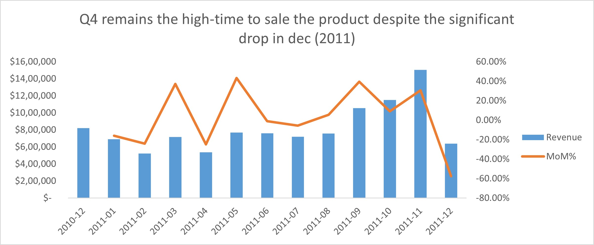
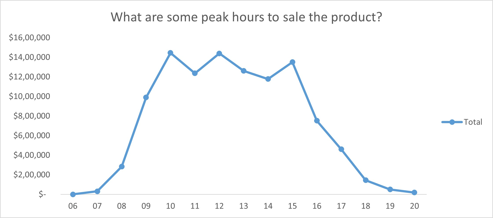
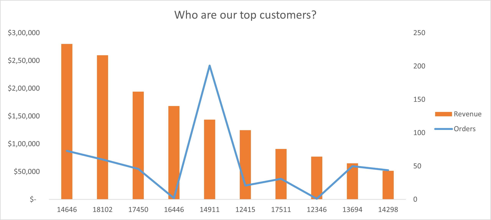
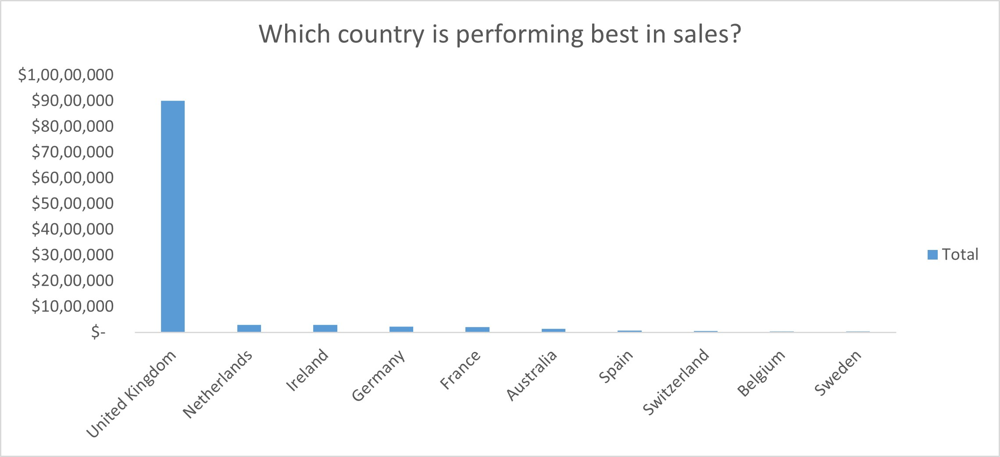

# Nova Shop Sales Analysis Dashboard (Excel)

## Overview

This project presents a **business-focused sales analysis** built in Microsoft Excel to evaluate **revenue performance, customer purchasing behavior, product contribution, and return impact** for a retail business.

The analysis is based on transactional sales data spanning **December 2010 to December 2011**. Rather than treating the dataset as “clean by default,” the project explicitly addresses **real-world data issues** such as cancellations, returns, and missing customer identifiers. The resulting dashboard provides both **high-level performance insights** and the ability to drill down by country.

Access the full analysis report here:  
[Analysis_report.pdf](Analysis_report/Analysis_report.pdf)

---

## Tools & Techniques Used (Excel)

- Power Query for ETL
- Pivot Tables & Pivot Charts for aggregation  
- Calculated fields & helper columns for business logic  
- Slicers & filters for interactive analysis  
- Time-based analysis (monthly trends, MoM% growth, hourly patterns)  
- Data cleaning logic for returns and cancellations  

---

## Sales Performance Analysis

### Overall Revenue Performance

- **Gross Sales** represent total transactional value, including returns.  
- **Net Sales** reflect actual realized revenue after accounting for returned products.

This distinction highlights the **true financial performance** of the business rather than inflated topline figures.

### Seasonal & Time-Based Trends

- Monthly analysis shows clear **seasonality**, with sales peaking in **Q4**, particularly **November**.
- Month-over-Month (MoM) growth reveals acceleration toward the end of the year, indicating strong demand during the holiday period.
- Hourly sales analysis indicates that **most revenue is generated between 9 AM and 3 PM**, suggesting optimal windows for promotions and staffing.

---

## Product Performance Insights

- Products were analyzed using **both units sold and revenue contribution**.
- Several products generate **high revenue despite lower sales volume**, indicating premium or high-value items.
- Conversely, some high-volume products contribute relatively less to total revenue.

This contrast supports **pricing, inventory, and promotional strategy decisions**, ensuring focus is not placed solely on volume-based performance.

---

## Customer & Order Analysis

- **Total Orders** capture purchasing activity and transaction frequency.
- **Average Order Value (AOV)** highlights customer spending behavior.
- The analysis shows that **high revenue is not always driven by high order counts**—some customers place fewer but significantly higher-value orders.

This insight reinforces the importance of tracking **orders alongside revenue**, as removing order metrics would hide the contribution of high-value purchasing behavior.

---

## Country-Level Insights

- Sales are highly concentrated in a few countries, with the top-performing country contributing a significant share of total revenue.  
- Several countries show strong revenue despite relatively fewer customers, indicating higher average order values.  
- Some regions record sales without customer attribution due to missing `CustomerID`, suggesting data quality limitations rather than absence of demand.  
- When filtered by country, the dashboard shifts from a global overview to a focused regional performance analysis, enabling deeper geographic insights.

---

## Returns & Operational Insights

- Returns have a **material impact on net sales**, making them critical for performance evaluation.
- Analyzing returns separately prevents distortion of:
- Revenue trends  
- Customer value metrics  
- Product rankings  

Return behavior can indicate:
- Product quality issues  
- Expectation mismatches  
- Logistics or fulfillment challenges  

---

## Key Business Takeaways

- Revenue is highly seasonal, with **Q4** driving a disproportionate share of sales  
- **High-value products** and **customers** play a crucial role despite lower transaction counts  
- Returns significantly affect net performance and must be monitored explicitly  
- Sales activity is concentrated in predictable daily time windows  

---

## Conclusion

This analysis highlights where revenue is truly coming from, how returns impact net performance, and which products, customers, and countries drive the most value. Clear seasonality and time-based patterns reveal opportunities for better planning and targeted sales strategies. Overall, the insights support more informed decisions around product focus, customer prioritization, and revenue optimization.

